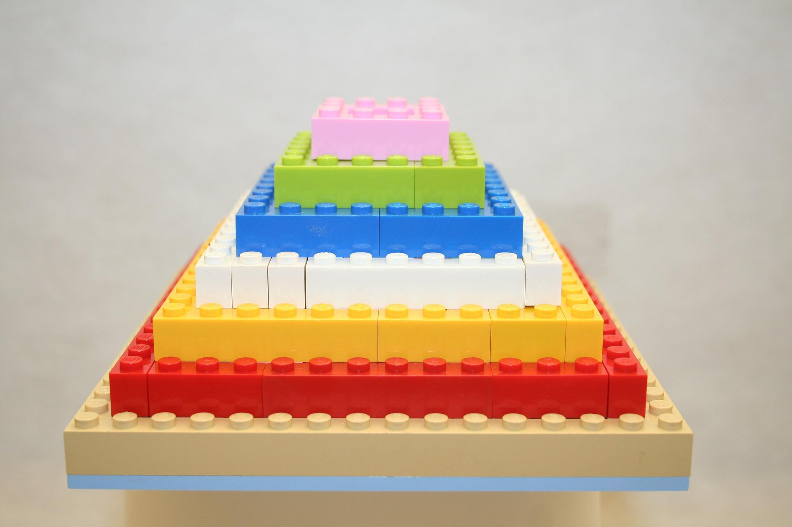

## Objectives
- Build problem solving skills.
- Gain experience developing algorithms:
  - Identifying, refining, ordering and arranging hierarchically a problem's algorithm into steps and sub-steps.
  - Clearly communicating the algorithm.
- Gain experience interpreting and communicating an algorithm's purpose.
- Learn how to submit an assignment. 
 
## Outcome
Successful submission (by the due date/time) of a text file, that correctly and completely expressing algorithms for all of the questions. 

## Instructions
1. Complete this assignment **individually or in groups of two**. Do **not** work together with more than one other classmate; that is unethical, counter to our university's and course's academic integrity policies, and deprives you and they of a learning opportunity. If you do work with another, **both students must independently submit their own copy of the work**, and **both names must be on BOTH  completed files**.
1. Access and respond to all of the following questions by adding to this assignment's starter file.
1. To submit, every student must provide their own set of answers to the questions. If you worked in a pair, **both of you** should submit a copy of the work and include **both partners' names**.

## Questions

### Question 1: Algorithm tracing & purpose

*5 marks. Emphasis on 'being the computer' & understanding an algorithm's purpose.*

Examine this algorithm:

```
ask user for number
set small = number
set large = number

ask user for another number
while user provides a positive number
    if number > large
    then
        set large = number
    otherwise
        if numer < small
        then
            set small = number
    
    again ask user for yet another number

share with user (large - small)
```

(a) Trace it, assuming the user provides these 5 numbers: 4, 6, 11, 3 and -2 when asked to by the algorithm. Expressing the state of all variables at each step and that which the algorithm shares until its completion.
    
(b) In grammatically complete sentences, express the purpose of the entire algorithm. **Not** what each step produces, but rather, describe the original problem the programmer intended to solve.

### Question 2: Designing & expressing an algorithm

*5 marks. Emphasis on expressing the steps with sufficient detail and in the correct order.* 

Examine the following step pyramid made from Lego:



**Your task:** Design & express an algorithm (steps and sub-steps) with sufficient detail that a university student **not** in a computer science course could successfully follow your algorithm and build the pyramid with the same dimensions and colour scheme as in the image.

*Notes:*

1. The structure is an approximation of a square pyramid: each level is a perfect square when viewed from above. You can assume the pyramid is solid (no interal spaces) and that each level consists entirely of the same colour.<br> **However, there is a 2 by 2 stud space centered on the top-most level**.

2. Assume you have an excess of all these sized pieces in all colours at hand. Lego blocks come in these sizes:
   - 1 by 1
   - 2 by 1
   - 4 by 1
   - 2 by 2
   - 3 by 2
   - 4 by 2
   - 16 by 16 baseplate

3. The order of the colours on the pyramid (from the top **down** to the baseplate) is:
   - pink
   - green
   - blue
   - white
   - yellow
   - red
   - beige
   - grey baseplate 

> ***Extra credit** (2 marks): In a separate algorithm, write out the steps your classmate would have to follow to determine the volume in cubic millimetres of this structure. If you choose to complete this extra credit, you will need to research and cite in your answer a web resource to find the blocks actual dimensions.*

### Question 3: Designing your own algorithm

*5 marks. Emphasis on algorithm design, identifying steps and sub-steps, & an ordered expression*

Recall something that **you** enjoy doing that you've had to work at to learn how to be proficient at it: cooking your favourite meal, 3D printing a toy, planting a garden, creating a craft etc. Pick an aspect of that talent that you can express as a one page algorithm (200-300 words or so). Develop and express that algorithm. Be sure to break your instructions down into sufficiently detailed sub-steps and communicate them in a clear order such that a classmate could follow your algorithm and be successful at it.

> *Let a roomate or friend **not** in the course have a look at your algorithm and have them provide you some feedback: Is your algorithm clear? Are the steps in an order they can follow? Do they think you've provided enough detail? Use their feedback (**citing that they contributed**) to improve your algorithm.*

## Starter file

Follow the link to GitHub Classroom on **your section's D2L page**. This ensures that your instructor sees your submissions.

Clone that repo - it will end up being named for you `f22-assign1-<mru-username>`, where **your** user name will be have been used.

The starter file is just a text file. Using a simple text editor (like Notepad, TextEdit or even VS Code) add your name (or names if you are working in pairs) and your responses to the three questions. Save your file locally and commit your changes to your assignment's rep as you work. 

> *It is good practice to save/commit often. If you are wondering 'Should I save/commmit now?", the best answer is always 'Yes'.* 

## Submission

You may push changes to GitHub any time up until the assignment deadline.## Submission

When you are done, copy the link to your repo and paste it into the appropriate D2L assignment dropbox, and then press the **Submit** button.

> *Note: only the file commited at the D2L submission time/date stamp will be marked. Further changes to the repo will **not** be graded.*

## Marking scheme
The entire assignment will be graded out of 15 marks, 5 marks per question. Marks for the questions will be allocated as follows:

| Question | A Grade (5)          | B Grade (4)        | C Grade (3)          | D Grade (2.5)         | F Grade (0)         |
| ---------: | :--------------- | :---------------  | :--------------- | :--------------- | :--------------- |
| 1. | Complete trace. Algorithm's purpose correctly/clearly communicated. | Small errors in trace. Algorithm's purpose is correctly/clearly communicated. | Larger errors in trace OR purpose is not clear.| Not fully/correctly traced AND incorrect/unclear purpose. | Not done |
| 2. | Algorithm clearly expressed & sequenced, and includies suffcient steps & details to be to be reproducible.| Algorithm clearly expressed & sequenced, BUT **missing a few details**.| Algorithm clearly expressed BUT is **unclear in sequence OR is missing important details/steps.** | Algorithm **not clearly expressed** AND is **missing important details/steps.** | Not done |
| 3. | Algorithm clearly expressed & sequenced, and includies suffcient steps & details to be to be reproducible. | Algorithm clearly expressed, sequenced, BUT **missing a few details**. | Algorithm clearly expressed BUT is **unclear in sequence OR is missing important details/steps.** | Algorithm **not clearly expressed** AND is **missing important details/steps.**| Not done |

Question 2's bonus: 2 marks awarded at the instructor's discretion.
