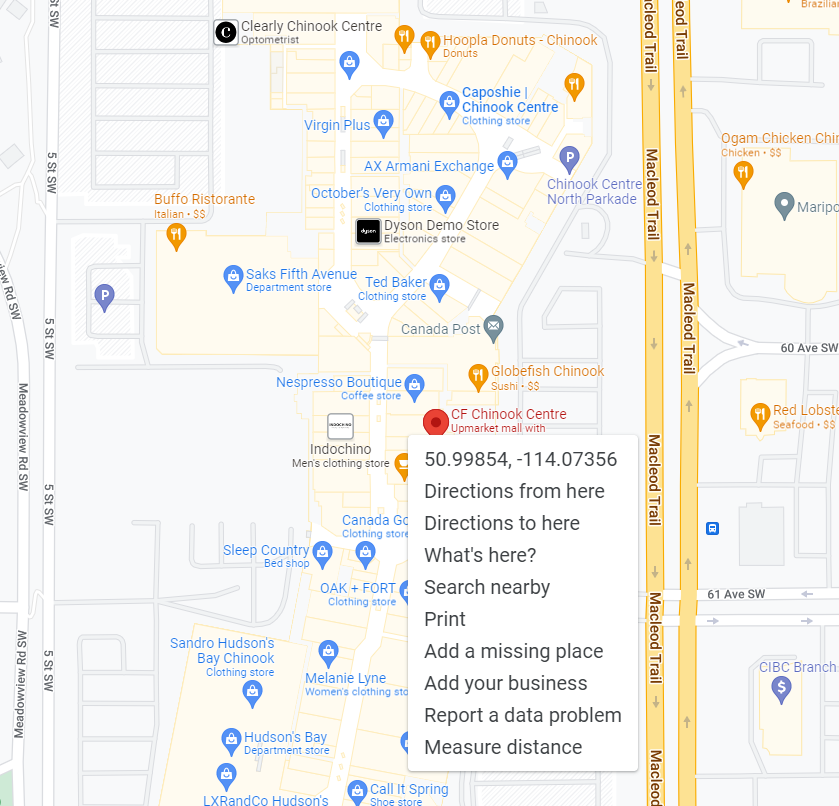

# Assignment 2: Input, Processing, and Output
Due on October 7, 2022, 5 PM

# Objectives:
Upon completion of this assignment, students will have had the opportunity to:
- Gain experience problem solving and debugging.
- Practice designing and expressing an algorithm as code that includes:
  - defining and using clear variable declarations & data types,
  - input,
  - mathematical operators, `math` module functions, and data types,
  - output with `fStrings`. 
  
# Outcomes:
Done **individually or in pairs**, this assignment consists of **two products**:

1. A **desk trace**, a text document that shows the values of all intermediate calculations required to solve the problem. In order to help you debug your code, we are asking you to work out (with a calculator) and write out the intermediate values for each step. *You are encouraged to show a draft of your trace to your instructor during the week before the assignment's due deadline.*
1. The **source code**: a Python algorithm that can find the distance between two Albertan locations where each is described by its latitude and longitude coordinates.

***

# Introduction 
The following problem is illustrative of the kind of computational problem  a program can solve. There are many required variables and a number of steps (and sub-steps). Be sure to use self-documenting variable names and consider using comments to describe your algorithm's steps. 

Because we are focussing on demonstrating effective programming techniques, we have simplified the problem from reality. Your ultimate answer may not be exactly the same as an online provided solution - though it should be within 5% or so.

# The problem:
<p align="center"> 
  <b>Develop a program that can find the distance between two Albertan locations where the first location is preset and the second comes from the user.<br>Then display those locations in D:M:S format and the distance found.</b>
  </p>

*Note:*  Since both longitude coordinates will be from the same hemisphere, we can simplify this problem and treat all coordinate values as positive numbers.

## The first location - The Homage statue on campus:

 [1]

> latitude:  51.013760
>
> longitude: 114.133691

## The second location- any location in Alberta **you** choose.

You can use an online resource like Google Maps to find the latitude and longitude of a location, in decimal degrees. For example, Chinook mall is located at:

 [2]

> latitude: 50.99854
> 
> longitude: 114.07356

*Note*: Again, we are using positive values for longitudes.

# Research efforts.

Although background information is presented here, a good problem solver knows to conduct their own research. If you don't understand some aspect of the material, consult with your partner and/or look it up. You will find solutions and online calculators for this type of problem on the internet, but ***you must ALWAYS cite the sources of your ideas.*** 

Citing can be done by adding comments like these to your code:

```
# Algorithm inspired by http://citebay.com/how-to-cite/stackoverflow/
# Location coordinates from Google Maps
```
*Notes:*
- There are published solutions that use programming structures and techniques we have not *yet* covered in our class. The purpose of this assignment is to assess your understanding of the course ideas. So, **you may ONLY use programming structures AND techniques that have been covered in class. You may NOT use `modules` other than the `math` module.** 
- ***Using programming concepts that we have not covered in the course, OR not honestly citing the idea sources could result in a zero grade for the assignment.***

# The Haversine Formulae:

To solve for the distance between the two points, your solution **must use the following articulation of the Haversine formula [3]**, a multi-step calculation that finds the approximate distance *as the crow flies*, i.e. ignoring hills, valleys and other vertical displacements.

The formula's steps are:

$$\begin{aligned}
a &= \sin^2\left(\frac{lat_1 - lat_2}{2}\right) + \cos(lat_1) \times \cos(lat_2) \times \sin^2\left(\frac{long_1 - long_2}{2}\right)\\
c &= 2 \times \mathrm{atan2}(\sqrt{a}, \sqrt{1 - a})\\
dist &= R \times c
\end{aligned}$$

Where:
- the location coordinates (latitudes and longitudes) are in **decimal degrees** and where each point *lat<sub>1</sub>, long<sub>1</sub>* and *lat<sub>2</sub>, long<sub>2</sub>* are converted to *radians*. They **cannot** be left in degrees because Python's math module's functions are designed to work only with radians).
- the variables *a*, *c* and *R*  represent intermediate values in the calculation

and

- R is the weighted average Earth radius which is determined by its own formula:

$$R = \frac{1}{3} \times (2 \times radius_e + radius_p)$$

Where:
- $radius_e$ = the Earth's equitorial radius which is 6,378,137 m
- $radius_p$ = the Earth's polar radius which is 6,356,752 m


*Notes:*
- The Haversine formula approximates the distance by acknowledging the Earth is not perfectly flat nor a perfect sphere; in fact the Earth is better described as "an 'obloid spheroid' (an ellipse rotated around its minor axis) with its larger radius at the equator than at the poles"[4]
- Carry all the decimal places for intermediate calculations and only display the final answer as indicated below in [Programming Requirements](#programming-requirements).
- Recall, the exponent operator in Python is not the ^ symbol. It's `**`.
- You will need to use some of Python’s built-in mathematical operators, functions like `= round()`
- You may use `math` module functions `= math.radians()` and the trigonometric functions like `= math.cos()`
  -  Be aware, many of these functions are designed to work with radians and not degrees.
  -  Also be aware, `= math.atan2` is different from `atan`. Make sure to use `atan2`!
-  The distance produced will be in the same units as those used to determine the weighted average Earth radius. You will have to convert it to km.

# Coordinate conversion from decimal notation to D:M:S:
Traditionally latitude and longitude coordinates are expressed in degrees, minutes and seconds but to perform calculuations, the coordinates start out as decimal degrees notation.

For the program's solution statement, convert both coordinate's decimal degree values to degrees, minutes and seconds.

Where:

- 1 degree = 60 minutes
- 1 minute = 60 seconds
 
Thus if the location of the *Homage* statue on MRU's campus at
> (51.013760, 114.133691)  decimal degrees

is also 

> (51<sup>o</sup> 0' 49.54" N, 114<sup>o</sup> 8' 1.29" W) in DMS format.

*Hint:* Modulus and floor division are useful operators to use.

*** 

# Programming requirements

Starting with the supplied 'haversine.py' file, write a program that:
1. Asks the user for the latitude and longitude of a location in decimal degrees.
1. Converts those values to radians.
1. Uses those values and the decimal degree coordinates for the Homage statue, performs calculations to find the Haversine distance in metres.
1. Converts both location coordinates into D:M:S format. Converts the distance to kilometers.
1. Displays both location coordinates in D:M:S notation (seconds displayed to 2 decimal places), and the distance between rounded to the tenth of a kilometer - km with one decimal place. <br>Be sure to use `fStrings` and show the symbols for degrees, minutes and seconds in the solution statement.

# Why Trace?

This algorithm has multiple steps and the solution path requires something like 20 intermediate values or variables. By working out those intermediate values by hand (and recording them as one of the assignment's two products) you will have access to the correct values your code needs to produce. This will make debugging your code much easier.


*Notes:*
- The distance between the Homage statue and the Chinook Mall is about 4.5 km. You can confirm your trace and/or your program using those values to test.
- You may ONLY use programming structures AND techniques that have been covered in class. 
- You may use the `math` module but no others.
  -  Using programming concepts or modules that we have not covered in the course, OR not honestly citing the idea sources could result in a zero grade for the assignment.
- Ensure your Python code is:
    - Correct (no logic errors) and completes the algorithm (complete)
    - Free of syntax errors.
        - For the purposes of this assignment, assume user input will always be valid and do not attempt to deal with run-time errors created by incorrect input.
    - Self-documenting by using clear mnemonic variable names that follow Python's standard naming conventions.
    - Comments included as necessary
    - Efficient, avoiding unnecessary steps
    - Includes clear input prompts
    - Outputs the answer explicitly
        - Displays correct symbols as instructed. You will have to explore how to use Unicode escape sequences to show the degree, minute and seconds symbols
        - Ignores negative coordinate values convention. 

***

# Starter files

Follow the instructor-provided URL & accept the GitHub Classroom assignment. That new repo will contain two files:
- haversine.py
  - starter code to get you going. 
- trace.txt
  - the beginning of the efforts you need to make to determine the value of the intermediate steps.

***

# Working on the assignment.

Recall that the *first time* you want to work on this assignment on a new computer, you will have to clone your online repo. 

Once cloned, each time you want to continue working, be sure to `git pull` any changes you made elsewhere **before making new changes**.

Then, like your process working on assignment 1, continue to `git add`, `git commit`, and `git push` to stage, add comments and upload your efforts. 

*Note:* You now have two files you are working on: the Python source code & the trace text file. Be sure to follow the correct process for both of those files.

***

# Submission

You may push changes to GitHub any time up until the assignment deadline for full marks.

Assignment submission requires 3 steps:

1. you **push** your changes to GitHub, then
1. you **verify** your changes are now on GitHub, then
1. you **copy/paste the URL** of your GitHub repo into a D2L text box<sup>1</sup>

<sup>1</sup>*Note:* Only the file committed at the D2L submission time/date stamp will be marked. Further changes to the repo will **not** be graded.

***
# Marking Scheme

Tracing (each part out of 4 = 20):
- [ ] Clear flow so that steps are easy to follow.
- [ ] All sub-parts of Haversine are correct.
- [ ] Weighted Earth radius is correct.
- [ ] Distance and coordinates converted to correct units.
- [ ] Clear expression of final answers.

Source code (each part out of 4 = 32):
- [ ] No syntax errors (runs).
- [ ] Self-documenting variable names.
- [ ] Algorithm correct (no logic errors).
- [ ] Input prompts clear.
- [ ] Sub-steps of Haversine are correct.
- [ ] Weighted Earth radius steps correct.
- [ ] Distance and coordinates converted to correct units.
- [ ] Output clear and shows symbols.

Total out of 52

*Note:*  
0/4 means not done or missing.   
1/4 means major errors.  
2/4 means major error or many small errors.   
3/4 means a few small errors.    
4/4 is correct/complete.

# Works Cited

[1]  "DREAM: Calgary's best kept public art secret?" Everyday Tourist. Feb 8, 2015 [Online.] Available: https://everydaytourist.ca/calgary-visitor-information/2015/2/7/dream-calgarys-best-kept-public-art-secret

[2] Google Maps. [Screen Capture]. Sept 23, 2022.

[3] "Calculate distance, bearing and more between Latitude/Longitude points", Movable Type Scripts. Accessed Jun 12, 2022. Available: https://www.movable-type.co.uk/scripts/latlong.html

[4] "Earth radius", Wikipedia: The Free Encyclopedia, [Editted May, 22, 2022] Available https://en.wikipedia.org/wiki/Earth_radius
