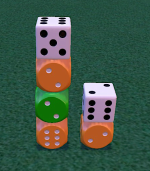

# Assignment 4: Comprehensive Program

**Due: Friday, December 2nd, 2022 @ ~~5:00 PM~~ time changed - see below**

**Weight: 10% of your final grade (9% for the coding portion and 1% for the written portion)**

You may do this assignment individually or in pairs.

## ⚠⚠⚠ UPDATED LATE POLICY, EFFECTIVE IMMEDIATELY ⚠⚠⚠
This assignment will be considered on-time if submitted by **23:59 on Friday, December 2nd**.

After that time, the following late penalties will be assessed:
- 10% if submitted by **23:59 on Sunday, December 4th**
- 20% if submitted by **23:59 on Monday, December 5th**
- 30% if submitted by **23:59 on Tuesday, December 6th**
- etc


## Background

[Blueprints](https://www.zmangames.com/en/products/blueprints/) is a game published by Z-Man Games where players build small "buildings" out of 6 dice. There are 4 types of dice, representing different building materials:

1. **black** dice (representing **stone**)
2. **orange** dice (representing **wood**)
3. **clear** dice (representing **glass**)
4. **green** dice (representing **recycled** materials)

Each of these materials score points in different ways...and that's where you come in. 

## What You Have To Do

Create a program that: 

  1. **reads** in a building from a text file, then 
  2. **writes** the score for that building into another text file.


## What Skills You'll Need

This is a hefty challenge! You will need to:
- Independently learn how the scoring of each material works by reading the game rules.
- Read text representing a building from a file, storing it as a list of lists.
- Create functions that calculate the material scores for a given building, for all four types of materials. Decision and repetition structures will be used here for sure.
- Write results with a specified format to another file. 

## Initial Legwork

So it's going to be _really_ hard to create code that scores a building if you don't know how to score a building using your own spongey human brain. 

Actually, scratch that - it'll be _impossible_ to do so.

So the first order of business is for you and your brain to get familiar with the scoring rules. Here are two suggestions of where to start.

1. The rules are [available here on the Zman site](https://images.zmangames.com/filer_public/81/0a/810a04df-26f8-4b01-a2de-b561719109d2/blueprints_rules.pdf). You'll be ecstatic to know there are 5 **very** brief paragraphs regarding material scoring at the top of page 4. These rules are super short. I'm serious.

2. To help cement the scoring process in your noodle, you might also look around the YouTube for videos on how to play the game. A number of them spend a few minutes covering scoring. One example is [this video by Ryan Metzler](https://youtu.be/ozGAhgBAbCo?t=314), which has a less-than-2-minute-long example [from the 5:14 mark](https://youtu.be/ozGAhgBAbCo?t=314) to the [7:07 mark](https://youtu.be/ozGAhgBAbCo?t=427).

    _You can ignore the bit Ryan says about the 6 points you get for "following your blueprint". That's not going to be part of this assignment._

Take the time - we're talking less than 5 minutes here, folks - to get a firm grasp of the scoring rules. It will reward you many times over.

## Simplifying Assumptions

In order to keep this assignment a reasonable length for y'all, we're going to make some assumptions that will make your life easier. And your sanity saner.

> _Simplifying problems by making assumptions is a standard tool in any developer's toolkit._

1. All buildings have 6 dice in them.
2. All buildings consist of 1, 2, or 3 stacks. These stacks are next to each other in a straight line. 
3. The text file containing the building to score is called `building.txt`, is located in a folder called `datafiles`, and is guaranteed to contain text representing a valid building.
4. The building files have a very specific format - see the following [Building File Format](#building-file-format-illustrated-with-examples) section.
5. The only scoring you will need to do is scoring of the materials in the given building - you do not need to worry about the Blueprint Bonus mentioned at the bottom of page 3 of the rules, nor the Awards used in the game.
6. All material scores, and the total score, will be at most 2 digits long.

### Building File Format Illustrated With Examples

The `building.txt` file has a very specific format. Here are 2 examples that should clear up what you'll need to deal with.

#### Example 1

Say we have the following building with 3 stacks:


_**Comment**  
Although the real game comes with really cool transparent dice for the glass material, we're representing it with a plain old white dice here._

We can see the numbers on top of the dice if we use a little antigravity wizardry here:


_**Comment**  
Actually, defying the laws of physics isn't really necessary for this building, as the only dice where the top number matters is the glass dice. Do you understand why? If not, I hope you haven't started coding yet..._

For this building, the associated `building.txt` file would contain exactly the following:

```
--|--|R6
--|R3|S6
G4|W2|S5
```

#### _Comments_

- `R6` represents the recycled material (green) die with a 6 on top
- `R3` is the other recycled material with a 3 on top
- `S6` is the stone material (black) die with a 6 on top
- `S5` is the other stone material with a 5 on top
- `G4` is the glass material (white) die with a 4 on top
- `W2` is the wood material (orange) die with a 2 on top
- `--` represents a gap where no die is present
- the pipe chacter (`|`) separates horizontally adjacent dice/gaps
- each line of text ends in a newline (`\n`) 
- **you can assume all letters will be uppercase**

### Example 2

Here's another building, this time with only 2 stacks:


This building would be represented by either of these `building.txt`:

```
G6|--|--
W4|--|--
R3|G2|--
W2|W1|--
```
or
```
--|G6|--
--|W4|--
--|R3|G2
--|W2|W1
```

_**Comment**  
You'll have to take my word for it that the dice tops you can't see have the numbers that I've provided._

## Solution Restrictions

While it's important to provide you with a good amount of leeway in _how_ you solve this problem, in order to make sure your instructor can see you're demonstrating the required skills for this assignment, your solution **MUST** follow these restrictions:

1. A **list of lists** must be used to represent a building.
2. The output file must be called `scoring-results.txt`, be saved in the `datafiles` folder present in the starting repository, and have a very specific format, which is covered in the section below.
3. You must have a `main()` function in a file called `asg4.py`. Your instructor will run that file to test your work.
4. Your solution can't use any Python that hasn't been covered in class up to this point. So (for example), you can't use dictionaries, tuples, external modules, and the like.

### Scoring Results File Format Illustrated With Examples

Let's use the same building examples that we did above. You should confirm that the scores shown in these examples jibes with what YOU think they should be, just to make sure you truly "get" how scoring works!

#### expected `scoring-results.txt` for example 1

As a reminder, here's the building...


...and here are the expected results for that building:

```
--|--|R6
--|R3|S6
G4|W2|S5

+----------+----+
| glass    |  4 |
| recycled |  5 |
| stone    |  5 |
| wood     |  6 |
+==========+====+
| total    | 20 |
+----------+----+
```

_**Comment**  
Notice how the building being scored is shown at the top of the file, followed by an empty line, followed by a table with the scoring results. For full marks, you'll want your table to be formatted **exactly** - and I mean **exactly** - as the one shown here. Remember that all material scores as well as the total will be at most 2 digits long._


#### expected `scoring-results.txt` for example 2

For this building...



with this starting file...

```
G6|--|--
W4|--|--
R3|G2|--
W2|W1|--
```
...we should get these results:

```
G6|--|--
W4|--|--
R3|G2|--
W2|W1|--

+----------+----+
| glass    |  8 |
| recycled |  2 |
| stone    |  0 |
| wood     | 12 |
+==========+====+
| total    | 22 |
+----------+----+
```

---

## Written Requirement
 
In this assignment, you are given a lot of freedom. One place you are **not** given freedom is in the format of the building files.

For this written portion of the assignment, please complete the following:

1. Describe **two challenges** that the format of the building file presented. **[4 marks]**
2. Briefly describe **an alternative file format** that would not pose the challenges you provided in `1`. **[2 marks]**
3. Briefly describe a **different challenge** that your alternative file format would pose. **[1 mark]**

Put your answers to the questions in the `written_requirement.txt` file.

---

## Grading

The code portion of this assignment is worth **9% of your final grade** and is marked on a grade ladder, like the ones you saw in assignment three and exercise four. Details follow below.

The written portion is worth **1% of your final grade** and is out of 7 marks, as indicated in [that section](#written-requirement).


### The Coding Portion Grade Ladder 

#### F Level

It's kinda hard to get an F...I mean, you really have to _want_ it.  
That being said, an F is possible if:

- [ ] nothing is submitted
- [ ] submitted code is **VERY** broken (for example, doesn't run at all)
- [ ] submitted code runs, but doesn't even *partially* solve *any* aspect of the assignment
- [ ] some of your submitted code is plagiarized or copied from another student or source. Don't be naughty.

#### D Level

A D level will be given to any submission that doesn't reach the C Level, but isn't so far gone as to get an F.

#### C Level

A submission will be considered C level work if:

- [ ] It represents buildings using a **list of lists**, and
- [ ] The application can process a valid `building.txt` file and produce correct scores for both **glass** and **recycled** materials; the format of the output can deviate _slightly_ from the expected format.

#### B Level

A submission will be considered B level work if:

- [ ] All requirements for the C level are met, and
- [ ] All output matches the expected format _exactly_.

#### A Level

A submission will be considered A level work if:

- [ ] All requirements for the B level are met, and
- [ ] The application can process a valid `building.txt` file and produce correct scores for **either** stone **or** wood materials.

#### A+ Level

A submission will be considered A+ level work if:

- [ ] All requirements for the A level are met, and
- [ ] The application can process a valid `building.txt` file and produce correct scores for **all** materials.


#### Grade Adjustments For Code Expressiveness

Since code is meant to be read, not just run, it is very important that it expresses its intention well. This can be accomplished in many different ways, but 4 "easy wins" are:

1. using functions to break down longer algorithms into meaningful "chunks", and
2. using well-named constants appropriately, and
3. providing useful comments in your code, including docstrings for your functions, and
2. naming variables and functions expressively

If your code is hard to understand because it ignores these easy wins, then the submission will either wind up in the minus side of a level, or, in extreme cases, might even go down to a lower level. 

_For example, if your submission fulfills the A Level requirements, but your code uses numerous poorly-named variables or functions (like 'x', where 'row' would provide more information) and makes little attempt to break up the solution into functions, then that A would drop down to an A- or a B+, depending on how egregious things are._

_Another example: if your submission fulfills the C Level requirements, but suffers from the same kinds of problems as in the previous example, your C might become a C-...or even a D+._

**Note that, unlike assignment 3, where you were given the opportunity to improve your mark by having "impressively expressive" code, here we're assuming that should be the default!**

---

## Citing Sources

If you use any outside resources, make sure you **cite your sources** by including a comment with your source.

**Failure to do so could very well result in a 0 for this assignment, which neither you, nor your instructor, wants.**

As with assignment 2, **you may ONLY use programming structures AND techniques that have been covered in class.** I know it's tempting to do fancy things, but consider it a challenge to stick to the basics.

Finally, citing a source does not give you carte blanche for copying code. If your code significantly duplicates that of another student or an internet resource, it may still be considered academic misconduct.
