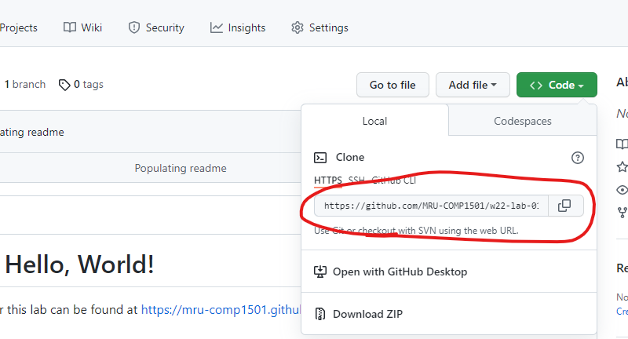

# Intro to Git and GitHub - version 1

## Introduction
In this course, you will be using [Git](https://git-scm.com/) and [GitHub](https://github.com/) to submit your assignments. This lab introduces you to those tools, as well as the instructional assistants. This is a **graded exercise** worth 4% of your final grade.

If at any point something is not behaving as expected or you get stuck, don't hesitate to ask your instructor, your peers, or the instructional assistants. 

## Objectives
The goals of this lab are to learn how to:
- Accept an assignment invitation from GitHub Classroom
- Clone a repository
- Configure Git on your local computer
- Check the status of your local Git repository
- Add files and stage changes
- Commit with a message
- Push changes back to GitHub
- Get to know the instructional assistants

## Setup
On a lab computer, or on a personal computer where you've **already installed Git**, launch Git Bash or Terminal.app on macOS.

By default, the terminal will open at your home directory (your H drive on the lab computers). Change to your `1501` or `1631` directory using the `cd` command, e.g:

```bash
cd 1501
```

If you are working on a personal computer, you may need to create this folder first with the `mkdir` command.

Next, Git needs to know who you are. Execute the following commands **one at a time**, replacing `<my name>` and `<myname@mtroyal.ca>` with your name and email address. This only needs to be done once on the lab computers or once on your home computer.

```bash
git config --global user.name "<my name>"
git config --global user.email "<myname@mtroyal.ca>"
```
Do not include the angle brackets (`<>`), these are just to indicate placeholders.

Keep your terminal open for the next part of this lab.

## Part 1: Clone the starter code for Assignment 1
1. In a web browser, [log in](https://github.com/login) to your GitHub account. If you haven't created one yet, do so now.
2.  Click on the "GitHub Classroom" link under Assignment 1 in D2L to join the classroom for the semester and clone the starter "code" for assignment 1. Select your name from the roster to link your MRU username to your GitHub account. This is not set in stone, please let your instructor know if you have a different preferred name.
   
    

3. Click on the "Code" button, then copy the URL from the pop-up window.
    

4. In your terminal, run the following command:

    ```bash
    git clone <url>
    ```

    where `<url>` is the URL you copied in the previous step (without the `<>`). To paste into Git Bash, either right click or press shift+insert (the standard Ctrl+C/Ctrl+V commands will not work). You can also drag and drop the URL with your mouse. Press enter to execute the command.

    Git Bash will prompt you to log in to GitHub to authenticate your username. You only need to do this once for each computer you use. If all goes well, the clone command will execute and download a README.md file into a new folder with the same name as your assignment repository. If you are on a Mac, you will need to generate an [access token](#macos-github-token).

5. Change into the directory you just cloned by typing `cd <repo name>`. Hit enter to execute the command. You are now working in your git repo and can check your status, commit changes, and push/pull changes to/from GitHub. **You must be "in" this folder for git commands to work**.

## Part 2: Make and commit changes
1. Open the repo you just cloned in Windows explorer or macOS Finder. Right click on the `.txt` file and open it with a text editor such as Notepad, Notepad++, or TextEdit. Enter your name where indicated. Make sure to **save the file** when you're done.

2. Go back to your terminal and check out the **status** of your current directory with the command `git status`. Since you have modified your starter file, you should see the `.md` file highlighted in red (it is not necessarily named README):

    

3. Next, **stage your changes** using the command:
    ```bash
    git add <filename>.md
    ```
    Remember that you can always use tab completion to type filenames faster. Check your status again - this time the `.md` file should be listed under "Changes to be committed".

4. **Commit** the staged changes with:
    ```bash
    git commit -m "Reason for committing"
    ```
    where `"Reason for committing"` should be changed to a **useful message** that describes why you are committing this change. Think of this like a "note to self".

    >Note: Git will not allow committing without a message, so if you forget the `-m` option, it will launch a text editor and ask you to write a message there. See [troubleshooting](#git-commit-opened-a-weird-looking-window) for instructions on how to close this, or ask for help from your instructor.

## Part 3: Push changes
To push your changes to GitHub, run the following command:

```bash
git push
```

That's it! Go back to the original URL that you copied in Part 1 and refresh the page. You should see your changes to the starter repo.

>If you'd like to go back and change anything, you can edit files and add/commit/push as many times as you want before the end of the lab period. The only thing you cannot change is your commit history and messages.

### Git commands
`git config`: Edits git configuration on your user profile

`git clone`: Download a copy of a repository to your local computer

`git status`: Show the current state of the git repository

`git add`: Add new files or changes to existing files to the staging area to be committed

`git commit`: take a snapshot of the current state and store it with a message

`git pull`: Retrieve changes from a remote repository 

`git push`: Send changes to a remote repository

## Grading

| Letter Grade | Description                                                                   |
| ------------ | ----------------------------------------------------------------------------- |
| F            | Nothing submitted, or plagiarism                                              |
| D            | A bare minimum attempt                                                        |
| C            | At least one large error and 2 or more small errors                           |
| B            | An attempt at all components with more than 2 small errors or one large error |
| A            | All components completed with one or two small errors                         |
| A+           | All components completed with no errors                                       |

Examples of **small errors**:
- Incorrect file names or extensions, including capitalization.
- Extraneous files committed to your repo; it should only include the modified `.txt` file.
- An uninformative commit message.

Examples of **large errors**
- Incoherent or incomplete responses to questions.
- Missing an assignment component.
- Commit message reads "Reason for committing"

## Troubleshooting
### Changes aren't showing on GitHub.com
Make sure that you have done all of the following:

 1. **Save the file** from your text editor.
 2. `git add <filename>`, where `<filename>` is the name of the file you are adding (e.g. `git add README.md`).
 3. `git commit -m "commit message"`, where `commit message` is a *useful* note about why you are committing the file.
 4. `git push`.

 If you still aren't seeing your changes on GitHub, make sure that you don't accidentally have multiple copies of your repo on your local computer. It's easy to accidentally edit one copy while git bash is open in another.

### git commit opened a weird looking window
If you forget the `-m` flag and just execute the command `git commit`, git will launch a text editor. By default, this is a command-line editor called [vim](https://www.vim.org/). Command line editors are really useful and worth learning, but if you want to go back to where you were, do the following:
- Press `Esc` (escape, top-left corner of your keyboard)
- Type `:q!`. That's colon, lowercase "q", then exclamation mark.
- Press `enter`

### macOS GitHub Token
If you are using a Mac, you will need to generate a "Personal access token" from your GitHub account and then use it instead of your password. [Here](https://docs.github.com/en/github/authenticating-to-github/keeping-your-account-and-data-secure/creating-a-personal-access-token) are GitHub's instructions, and [here's](https://www.youtube.com/watch?v=s-CN4RaNq8A) a video that walks through how to use it with the macOS Keychain Access tool. You'll need to check the "repo" box in Scope settings and set the expiry date for at least the end of the semester so you're not having to constantly regenerate it.

After generating a token you can use it instead of your GitHub password in the terminal. Copying and pasting is a bit odd as it will not actually show the text when you paste into a password prompt.
