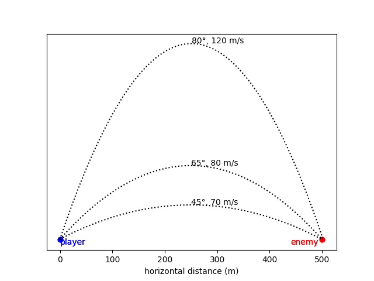

# Debugging & Testing

## Introduction
This tutorial allows you to practice debugging code.

Imagine your company is developing a turn-based tank battle game (like the classic [Scorched Earth](https://en.wikipedia.org/wiki/Scorched_Earth_(video_game)) game). Players take turns selecting a **launch angle** and **velocity** to launch a projectile at the other player, and the first to hit their opponent wins.

Unfortunately, your coworker has just won the lottery and quit, leaving you with some half-finished code. She has written a function to compute how far a projectile will travel given a launch angle and velocity, but the code hasn't been debugged yet.

Projectile kinematics says that for a projectile launched on a flat surface, the flight-time (time in the air, until the projectile lands) satisfies the quadratic equation:

> -½ *g t*<sup>2</sup> + *v* sin(*a*) *t* = 0
>  
> where,  <br>
> *t* is the flight time in seconds <br>
> *a* is the angle of launch  <br>
> *v* is the velocity of launch in m/s  <br>
> *g* is acceleration due to gravity (9.81 m/s<sup>2</sup> on earth) 

Given velocity *v* and angle *a*, this equation can be solved for *t*, like this:

> $$t = \frac{v\sin(a)}{\frac{1}{2}g}$$

Once you have a value for _t_, you can find the horizontal distance travelled by:

> *x* = *v* cos(*a*) *t*
> 
> where,  <br>
> *x* is the horizontal distance travelled  <br>
> *v* is the velocity of launch in m/s  <br>
> *a* is the angle of launch  <br>
> *t* is the flight time in seconds

Your coworker has written the function below to compute horizontal distance travelled by a projectile. The intent of the function is to accept launch angle and velocity as parameters, and use the equations above to compute *t* and compute (and return) *x*.

```python
# this next line gives access to cos, sin, and sqrt (square-root) functions
from math import cos, sin, sqrt  


g = 32.2 # gravitational acceleration = 32.2 ft/s/s


def calculate_landing_point(angle: float, velocity: float) -> float:
"""
compute the horizontal distance the projectile will travel
:param angle: launch angle from horizontal, in radians
:param velocity: velocity in meters / second
:return: distance travelled in meters
"""

temp1 = velocity * sin(angle)
t = temp1 / 0.5 * g
x = velocity * cos(angle) * t

return x
```


She has already done the math on paper, and identified 3 trajectories (shown below) that would cause the projectile to travel 500 m.

_Note: The 80° and 65° trajectories don't exactly hit the 500 m mark - but they are "good enough"!_



*Figure 1: Three sample trajectories that will cause a projectile to travel 500 m*

## Exercises
1. Paste the code above into your IDE. 
2. Do some initial detective work by reading through the code and its comments:
    - [ ] Do you see any mistakes in the code right away?
    - [ ] Is the function using the formulas as intended?
    - [ ] Does the IDE highlight any errors that would prevent the code from running?

3. Use the three angle-velocity pairs in Figure 1 above as test inputs to the function (read the function comments carefully & ensure you pass in appropriate values). Is the output close enough (say within 3m) to the expected 500 m?

4. Manually trace the code in `calculate_landing_point` using one of the test inputs. Use a calculator to compute the expected results of each intermediate calculation.

5. Now that you've done the manual trace, find and correct all the bug(s) in the code.  
   **Hint: there are 3 bugs!**

6. Which of these debugging techniques did you use to find the bugs?
    - [ ] visual inspection
    - [ ] letting the IDE highlight syntax errors
    - [ ] checking whether code implements the intended functionality
    - [ ] manual code tracing
    - [ ] commenting out some lines of code to simplify the program
    - [ ] adding `print` statements to print out intermediate results for inspection
    - [ ] using breakpoints and IDE debugger to step through the code
    - [ ] calling a function with test inputs to check its functionality
    - [ ] anything else not on this list?
