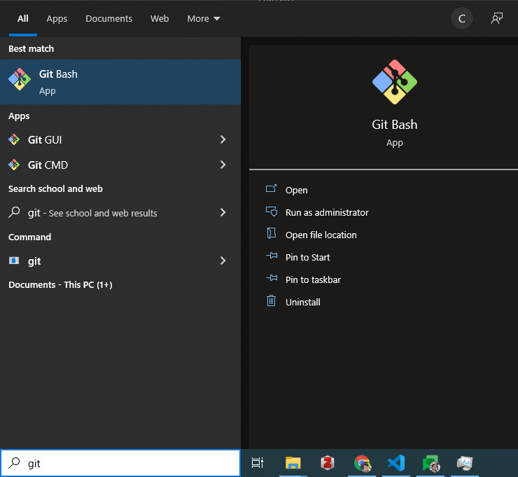
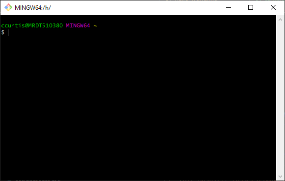
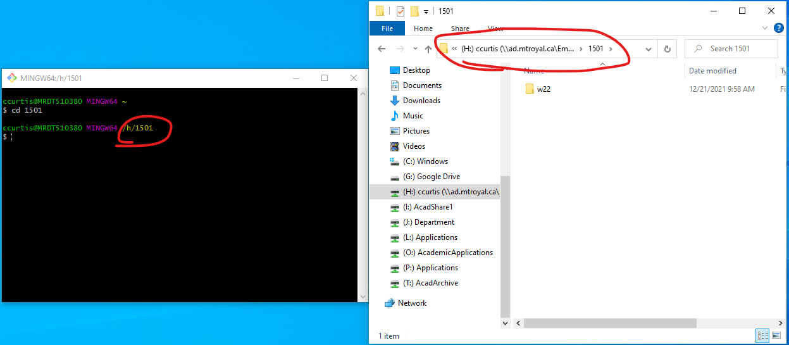
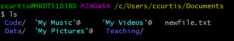
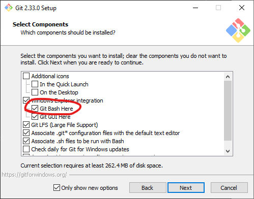

# Intro to the Terminal
<!-- Check out T:\CompSci\1631 (was 2231)\labs\linux labs\Fall 2021 -->

For this tutorial, we will be working with Bash syntax, which comes with Git for Windows. The default Windows "command prompt" is similar, but uses different syntax. 

Git for Windows is pre-installed on the lab computers. If you would like to work on a personal computer, follow the steps under [software](#software).

## Instructions
The goal of this lab is for you to become familiar with the computer labs and their PCs, to get  you started with the terminal. Read through the lab carefully, and try the exercises in order.  If you have trouble or get confused, ask your instructor or an Instructional Assistant for help. This lab assumes that you have activated your MyMRU account and remember your password.  If you have not done so, or if you are unsure how to use MyMRU, please consult with your instructor or an Instructional Assistant.

### Using the MRU Computer Labs
There are many computer labs on the MRU campus to which you may have access, but some have been set aside specifically for COMP students. Specifically, as a COMP 1501 or 1631 student, you have access to B103, B107, B162 and E203. B103, B107 and B162 labs are the ideal places to be, since these rooms are also the homes of the Instructional Assistants (IAs).  During regular hours, the IAs – Jordan and Steve – are available to help you.

The IAs are available to:
- help you with any technical problems you experience while using MRU’s computer systems;
- give you guidance, when needed, with coursework, especially with COMP 1501 or 1631 programming assignments.

Don’t hesitate to ask them when you need some assistance.  They can also be contacted via e-mail at [compias@mtroyal.ca](mailto:compias@mtroyal.ca).

The labs are available on a 24-hour basis.  An MRU OneCard is required for access.  You must be registered in a COMP course in order to access the lab rooms corresponding to the course.  Be aware that the lab PCs auto-shutdown at midnight, unless a user is there to override the shutdown process. If you are going to be in the labs after 10 p.m. ideally you should inform MRU Security Services you are in the lab, but at a minimum make certain you have your OneCard with you.

It is your responsibility to familiarize yourself with the rules governing MRU lab use, and also with the consequences for violating them.  Please carefully review the rules posted on the MyMRU login page under the Acceptable Use Policy link

## Run Git Bash
Open up a terminal by clicking on the Start menu and typing "git". Git bash should be the first or second choice; click on it to run it.



This will open up a deceptively unassuming little black window that looks like this:



## Bash commands: the basics
Bash commands are actually **executable files** or **programs** that run when you type their name. Some can take **arguments**, which are things that you want the command to operate on. For example, try typing the following, and then hit Enter:

```bash
echo "Hello"
```

In this example, `echo` is the **command** and `"Hello"` is the **argument**. You've just told the computer to print the word `"Hello"` to the terminal.

Now try the following and see how things change:

1. Change `"Hello"` to something else.
2. Remove the space between `echo` and `"Hello"`.
3. Try typing two `echo` commands on one line, e.g:
    ```bash
    echo "Hello" echo "Goodbye"
    ```

>Note: You will find that you can't click on the line to move the cursor. Once your terminal is open, you need to use the **arrow keys** and **home/end** to move the cursor to a different position in the line. You can also hold `Ctrl` and then each time you press the arrow keys you jump an entire word instead of one character.

Summary: it is important to type the exact **command**, but **arguments** can change. Commands must be written **one line at a time** with a space between the command and any argument(s).

### Cancel that!
If at any point you want to cancel the current command and start over, use the keyboard shortcut `Ctrl C`  or `⌘ .` on a macOs. This is particularly useful when your Python code gets out of hand and you end up with an infinite loop.

## Navigating around
In this section, the following commands are discussed:

| Command | Arguments       | Description                                                                   |
| ------- | --------------- | ----------------------------------------------------------------------------- |
| `ls`    | `<dir>` or None | List directory contents. If no argument is provided, lists current directory. |
| `cd`    | `<dir>`         | Change into specified directory                                               |
| `pwd`   | None            | Print the working directory                                                   |

One of the most important things to know how to do in the terminal is to move from one **directory** (aka a "folder") to another and print information about the various **files** and **subdirectories** that are present. Files, like text files (with **extension** `.txt`), Word documents (`.docx`), and Python code (`.py`) are stored in directories, like the "1501" directory on your "H:" drive on the lab computers, or the "Documents" directory of your personal computer.

In Windows, if I want to open a folder named "1501", I double click on it. To do the same thing in the terminal, use the command `cd` with the directory name as an argument. For example:

```console
cd 1501
```

If you are on the lab computer, you should see the **path** in your terminal change to show that you are now working in the 1501 directory. This is similar to the path that is shown in the Windows file browser (your H drive will be different from mine):



> If you are working on a personal computer, you probably don't have a directory named 1501 and will see this message:
```plaintext
bash: cd: 1501: No such file or directory
```
This means you just tried to **change directory** (`cd`) with an invalid **argument** (1501). Instead, try to change into a directory that does exist, such as "Documents", "Pictures", etc.

Once you are in a new directory, you can look around and **list the contents** using the command `ls`:

```bash
ls
```

For example, I get the following output when I list the contents of my "Documents" directory:



>Depending on your configuration, you might not see all the colours and decorations (`@` or `/`) on your output. To enable this, try adding the **flag** `-F` so that your command is now `ls -F`.

Items ending in '/' are other **directories**, also called **subdirectories** of the **parent** (in this case, "Documents" is the parent directory). 

**From your list of directories**, pick one and `cd` into it, then run `ls` again to see what files and directories exist in your new location. Then, open the same folder in the Windows/mac file browser to compare how things look and make sure you understand where you are in the file system.

Great, you can now go into a folder and look around. How do you get back out?

It turns out there's a handy shortcut for the **parent** directory. No matter where you are, `..` refers to the folder containing the directory you are currently in, while `.` refers to the **current** directory. Therefore, to go up a level, use the command:

```bash
cd ..
```

You can also do `cd .`, but it won't do anything - this says "change into the current directory".

There's a couple more special symbols, feel free to play around with them.

| Special Arguments | Description                               |
| ----------------- | ----------------------------------------- |
| `.`               | Refers to the current directory           |
| `..`              | Refers to the parent directory            |
| `~`               | Refers to your home directory             |
| `/`               | Refers to your file system root directory |

If you ever get lost you can print the path to your current location with the command `pwd`, short for "print working directory".

If you want to change into a subdirectory in another subdirectory, you can string them together with `/` separating each directory. Additionally, if there are **spaces in the name**, it needs to be enclosed in quotes. For example, if I'm in my "home" directory and I want to go to the "Code" directory inside "Documents", I would do the following:

```bash
cd Documents/Code
```

However, if I then want to go into a directory named "COMP 1501", I need to include the quotes:

```bash
cd Documents/Code/"COMP 1501"
```

## Options and flags
In addition to arguments, many commands can take **options** or **flags**. These are typically written with either a single `-` and a single letter (short form), or `--` and a word (long form). For example, to show all files including hidden ones, you can use the option `-a` with `ls`:

```bash
ls -a
```

Alternatively, you can use the long form `--all` to be more explicit. The functionality is identical:

```bash
ls --all
```

Some options can take arguments, though how they are defined is inconsistent from one command to the next. If an option does not take an argument (such as `-a` shown above) then it is also called a **flag**.

## Up arrow and tab completion
All this typing can be a bit tiring, but there are two keyboard shortcuts that make things a lot faster.

**Up arrow** re-types the last command you ran. It does not run it for you, so it gives you a chance to go back and modify things.

**Tab completion** fills in the rest of a command or filename matching the first few characters. For example, if you start typing `cd "My` and then press "tab", it will list all the directories starting with "My" such as "My Music", "My Videos", etc. You can type more of the word and it will narrow down the options, and when there is only one possibilty remaining (e.g. "My M" narrows it down to "My Music"), the entire filename or command will fill in.

## Directory Maze
Our intrepid IA Jordan has created a directory maze for you to explore. On a lab computer, open up Windows Explorer, click on "My Computer", then double click on the `I` Drive ("AcadShare1"). From there, go to `Labs->CompSci->Resources->Everyone->directory-maze`. Open a new Git Bash window by right-clicking in the empty white space of the folder and selecting "Git Bash Here". Alternatively, you can try navigating to it yourself with `cd` and tab completion, starting with `/i/Labs`.

Once you have the directory maze open, try travelling around Alberta!

## Optional extras
`cd`, `ls`, and tab completion/up arrow are the most important skills for working with Git and Python. However, if you're interested in more terminal skills, the following table summarizes some other important ones. 

Try testing your knowledge at [cmdchallenge.com](https://cmdchallenge.com/)!

| Command | Arguments      | Description                                                                                                                |
| ------- | -------------- | -------------------------------------------------------------------------------------------------------------------------- |
| `cat`   | `<filename>`   | Prints the entire contents of the file to the terminal                                                                     |
| `head`  | `<filename>`   | Prints the first 10 lines of `<filename>` to the terminal                                                                  |
| `tail`  | `<filename>`   | Prints the last 10 lines of `<filename>` to the terminal                                                                   |
| `cp`    | `<src> <dest>` | Copies the file `<src>` to a file named `<dest>`                                                                           |
| `mkdir` | `<dir>`        | Make a new directory with the specified name                                                                               |
| `touch` | `<filename>`   | Make a new empty file with the specified name. If `<filename>` exists, updates the "last modified" time with current time. |
| `rm`    | `<filename>`   | Delete ("remove") the file                                                                                                 |

## Software
### Windows
1. Install [Git for Windows](https://gitforwindows.org/), making sure to check the "Git Bash Here" option:



### Mac
Open the Terminal.app following [these instructions](https://www.howtogeek.com/682770/how-to-open-the-terminal-on-a-mac/).

## Terminology nitty-gritty
There's a lot of different terms thrown around for this stuff, and they all seem to describe entering text into a black window and making a computer do something. For the sake of consistency I will try to use "terminal", but you may also see:

- **Terminal** (technically terminal emulator): an environment for text input/output. Your Python code can write to the terminal and accept input from the terminal. The terminal also provides a **command line interface**.
- **Console**: More or less synonymous with **terminal**, but traditionally the console is a **hardware** interface.
- **Command line/CLI**: The command line or "command line interface" (CLI) is a place where you can **type commands** to make the computer do your bidding.
- **Shell**: The application layer that interprets the commands you type and passes them on to your operating system. Different shells exist, such as BASH (the "Bourne again shell"), common on mac/Linux, and Powershell or Command Prompt on Windows.
